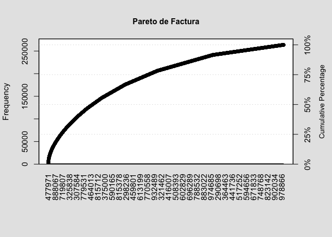

    library(dplyr)

    ## 
    ## Attaching package: 'dplyr'

    ## The following objects are masked from 'package:stats':
    ## 
    ##     filter, lag

    ## The following objects are masked from 'package:base':
    ## 
    ##     intersect, setdiff, setequal, union

    library(lubridate)

    ## 
    ## Attaching package: 'lubridate'

    ## The following objects are masked from 'package:base':
    ## 
    ##     date, intersect, setdiff, union

    library(tidyr)
    library(stringr)
    library(ggplot2)
    library(leaflet)
    library(ggQC)
    library(qcc)

    ## Package 'qcc' version 2.7

    ## Type 'citation("qcc")' for citing this R package in publications.

    library(plotly)

    ## 
    ## Attaching package: 'plotly'

    ## The following object is masked from 'package:ggplot2':
    ## 
    ##     last_plot

    ## The following object is masked from 'package:stats':
    ## 
    ##     filter

    ## The following object is masked from 'package:graphics':
    ## 
    ##     layout

    data <- read.csv("c1.csv")

    # Formato de fecha a yyyy-mm-dd
    data$Fecha <- dmy(data$Fecha)
    # Eliminación de las ultimas variables (X,X.1, X.2, X.3, X.4, X.5) que no representan ningun valor al análisis
    data <- data %>% select(!c(X,X.1, X.2, X.3, X.4, X.5))
    # Formato tidy para las columnas de rango de distacia a una sola
    data <- data %>% 
      mutate(X5.30=gsub(pattern = "  ", replacement = NA, x = X5.30),
             X30.45=gsub(pattern = "  ", replacement = NA, x = X30.45),
             X45.75=gsub(pattern = "  ", replacement = NA, x = X45.75),
             X75.120=gsub(pattern = "  ", replacement = NA, x = X75.120),
             X120.=gsub(pattern = "  ", replacement = NA, x = X120.))
    data <- data %>% 
      gather(Distancia, temp, X5.30:X120. , factor_key = TRUE) %>% 
      na.omit() %>% 
      select(!temp)
    data <- data %>% 
      mutate(Distancia = str_replace_all(Distancia, c("X" = "", '\\.' = "-")))
    # Eliminación del simbolo "Q" de Quetzales a las columnas númericas
    data <- data %>% 
      mutate(Camion_5=gsub(pattern = 'Q-', replacement = NA, x = Camion_5),
             Pickup=gsub(pattern = 'Q-', replacement = NA, x = Pickup),
             Moto=gsub(pattern = 'Q-', replacement = NA, x = Moto))
    # Unir columnas Camión, pickup y Moto a una sola variable "TipoV"
    data <- data %>% 
      gather(Tipov, Costo, Camion_5:Moto, factor_key = TRUE) %>% 
      na.omit()
    data <- data %>% 
      mutate(Costo=gsub(pattern = "Q", replacement = "", x = Costo))
    data$Costo <- as.numeric(data$Costo)
    # Costos Directos
    # Unir columnas de costos directos de cada tipo de vehiculo
    data <- data %>% 
      mutate(DirectoCamion=gsub(pattern = 'Q-', replacement = NA, x = directoCamion_5),
             DirectoPickup=gsub(pattern = 'Q-', replacement = NA, x = directoPickup),
             DirectoMoto=gsub(pattern = 'Q-', replacement = NA, x = directoMoto))
    # Unir las columnas de costos directos en una sola "Cst_Directo"
    data <- data %>% 
      gather(Tipo, Cst_Directo, DirectoCamion:DirectoMoto, factor_key = TRUE) %>% 
      na.omit() %>% 
      select(!Tipo)
    # Eliminación del simbolo "Q" en Cst_Directo
    data <- data %>% 
      mutate(Cst_Directo=gsub(pattern = "Q", replacement = "", x = Cst_Directo))
    data$Cst_Directo <- as.numeric(data$Cst_Directo)
    # Costos Fijos
    # Unir columnas de costos fijos de cada tipo de vehiculo
    data <- data %>% 
      mutate(FijoCamion=gsub(pattern = 'Q-', replacement = NA, x = fijoCamion_5),
             FijoPickup=gsub(pattern = 'Q-', replacement = NA, x = fijoPickup),
             FijoMoto=gsub(pattern = 'Q-', replacement = NA, x = fijoMoto))
    # Unir las columnas de costos fijos en una sola "Cst_Fijo"
    data <- data %>% 
      gather(Tipo, Cst_Fijo, FijoCamion:FijoMoto, factor_key = TRUE) %>% 
      na.omit() %>% 
      select(!Tipo)
    # Eliminación del simbolo "Q" en Cst_Fijo
    data <- data %>% 
      mutate(Cst_Fijo=gsub(pattern = "Q", replacement = "", x = Cst_Fijo))
    data$Cst_Fijo <- as.numeric(data$Cst_Fijo)
    # Eliminación del simbolo "Q" en "factura"
    data <- data %>% 
      mutate(factura=gsub(pattern = "Q", replacement = "", x = factura))
    data$factura <- as.numeric(data$factura)
    # Fortmato a FACTOR a variables categoricas
    data <- data %>% 
      mutate(Cod = as.factor(Cod),
             origen = as.factor(origen),
             height = as.factor(height),
             Distancia = as.factor(Distancia))
    # Calculando Ingresos
    data$Ingreso <- data$factura - data$Costo
    # Eliminación de las columnas antiguas de costos
    data <- data %>% select(!c(directoCamion_5,directoPickup,directoMoto,fijoCamion_5,fijoPickup,fijoMoto))

    # situacion de la emporesa
    vetnas <- data %>% 
      mutate(Mes = month(Fecha)) %>% 
      group_by(Mes) %>% 
      summarise(Ventas = sum(factura),
                Costo = sum(Costo))
    ggventas <- ggplot(vetnas,aes(x = Mes, y = Ventas))+
      geom_bar(stat='identity', width = 0.5, fill = "steelblue")+
      ggtitle("Ventas")+
      labs(x = "2017", y = "Q")+
      theme_minimal()
    ggventas2 <- ggplotly(ggventas)
    ggventas2

    #Estado de resultados
    Factura <- sum(data$factura)
    Costo <- sum(data$Costo)
    Utilidad_Bruta <- Factura - Costo
    Margen_Bruto <- Utilidad_Bruta/Factura
    Margen_2018 <- Margen_Bruto/1.25
    Utilidad_2018 <- Margen_2018*Factura
    Factura

    ## [1] 36688096

    Costo

    ## [1] 28174019

    Utilidad_Bruta

    ## [1] 8514077

    Margen_Bruto

    ## [1] 0.2320665

    Utilidad_2018

    ## [1] 6811262

    Margen_2018

    ## [1] 0.1856532

    #pareto
    tabla_postes <- table(data$ID)
    Pareto_factura <- pareto.chart(tabla_postes,
                                    main = "Pareto de Factura")

    #analisis de recorrido
    distanciasefectivas <- data %>% 
      group_by(Distancia) %>% 
      summarise(Costo = sum(Costo),
                Ingreso = sum(Ingreso),
                Viajes = n(),
                Relacion = round(Ingreso/Viajes,2))
    ggdistanciasingreso <- ggplot(distanciasefectivas,aes(x = reorder(Distancia, Ingreso), y = Ingreso))+
      geom_bar(stat='identity', width = 0.5, fill = "steelblue")+
      geom_text(aes(label=Ingreso), vjust=0.5, color="black", size=4)+
      ggtitle("Ingreso por Distancia")+
      labs(x = "Distancia", y = "Ingreso")+
      coord_flip()+
      theme_minimal()
    ggdistanciasingreso2 <- ggplotly(ggdistanciasingreso)
    ggdistanciasingreso2

    ggdistanciasef <- ggplot(distanciasefectivas,aes(x = reorder(Distancia, Relacion), y = Relacion))+
      geom_bar(stat='identity', width = 0.5, fill = "steelblue")+
      geom_text(aes(label=Relacion), vjust=0.5, color="black", size=4)+
      ggtitle("Relacion por Distancia")+
      labs(x = "Distancia", y = "Relacion")+
      coord_flip()+
      theme_minimal()
    ggdistanciasef2 <- ggplotly(ggdistanciasef)
    ggdistanciasef2

    #Unidades eficientes
    Vehiculos_eficientes <- data %>% 
      group_by(Tipov) %>%
      summarise(CostoDirecto = sum(Cst_Directo),
                CostoFijo = sum(Cst_Fijo),
                Factura = sum(factura),
                Ingreso = sum(Ingreso))
    ggdirectcost <- ggplot(Vehiculos_eficientes,aes(x = reorder(Tipov, CostoDirecto), y = CostoDirecto))+
      geom_bar(stat='identity', width = 0.5, fill = "steelblue")+
      geom_text(aes(label=CostoDirecto), vjust=0.5, color="black", size=4)+
      ggtitle("Costo Directo por Unidad")+
      labs(x = "Unidad", y = "Cst. Directo")+
      coord_flip()+
      theme_minimal()
    ggdirectcost2 <- ggplotly(ggdirectcost)    
    ggdirectcost2

    ggfijocost <- ggplot(Vehiculos_eficientes,aes(x = reorder(Tipov, CostoFijo), y = CostoFijo))+
      geom_bar(stat='identity', width = 0.5, fill = "steelblue")+
      geom_text(aes(label=CostoFijo), vjust=0.5, color="black", size=4)+
      ggtitle("Costo Fijo por Unidad")+
      labs(x = "Unidad", y = "Cst. Fijo")+
      coord_flip()+
      theme_minimal()
    ggfijocost2 <- ggplotly(ggfijocost)
    ggfijocost2

    ggingreso <- ggplot(Vehiculos_eficientes,aes(x = reorder(Tipov, Ingreso), y = Ingreso))+
      geom_bar(stat='identity', width = 0.5, fill = "steelblue")+
      geom_text(aes(label=Ingreso), vjust=0.5, color="black", size=4)+
      ggtitle("Ingreso por Unidad")+
      labs(x = "Unidad", y = "Ingreso")+
      coord_flip()+
      theme_minimal()
    ggingreso2 <- ggplotly(ggingreso)
    ggingreso2

    #Actividades de la empresa
    actividadesef <- data %>% 
      group_by(Cod) %>% 
      summarise(costo = sum(Costo),
                Ingreso = sum(Ingreso),
                Cantidad = n(),
                relacion = sum(Ingreso)/Cantidad)
    ggactingreso <- ggplot(actividadesef,aes(x = reorder(Cod, Ingreso), y = Ingreso))+
      geom_bar(stat='identity', width = 0.5, fill = "steelblue")+
      ggtitle("Ingreso por Actividad")+
      labs(x = "Actividad", y = "Ingreso")+
      coord_flip()+
      theme_minimal()
    ggactingreso2 <- ggplotly(ggactingreso)
    ggactingreso2

    ggactrel <- ggplot(actividadesef,aes(x = reorder(Cod, relacion), y = relacion))+
      geom_bar(stat='identity', width = 0.5, fill = "steelblue")+
      ggtitle("Relacion por Actividad")+
      labs(x = "Actividad", y = "Relacion")+
      coord_flip()+
      theme_minimal()
    ggactrel2 <- ggplotly(ggactrel)
    ggactrel2

